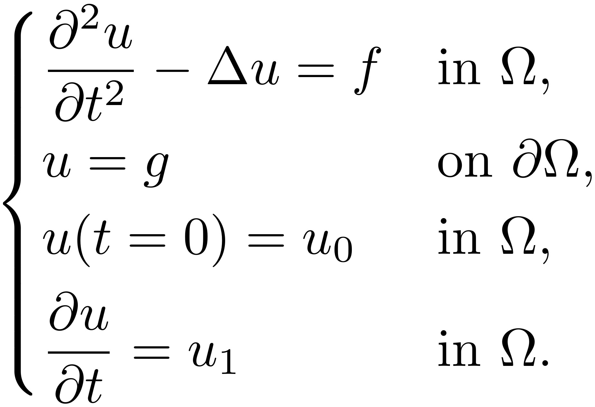
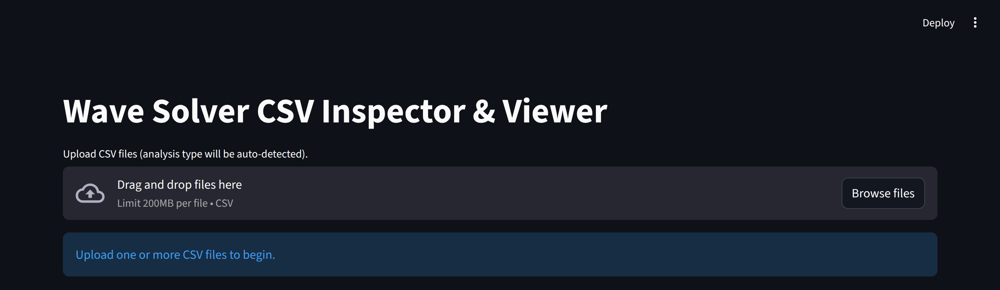
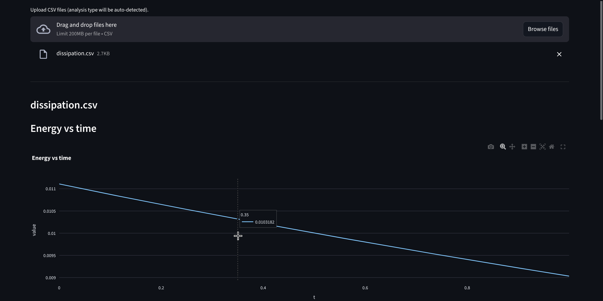

# Wave Equation Solver (deal.II)

[](./LICENSE)


A compact **2D wave equation** solver using the **finite element method** with **deal.II**.
Built for teaching/experimentation (PoliMi *Numerical Methods for PDEs*), but structured like a small reproducible research code.

- Spatial discretization with deal.II FE spaces (**MPI-parallel**).
- Time integration via **Theta / Central Difference / Newmark** schemes.
- VTK output (`.vtu/.pvtu`) for ParaView.
- Manufactured Solution (MMS) mode with optional **error history CSV** export.
- Optional "study" outputs (**dissipation**, **modal tracking**, **convergence study**) as CSV.
- End-to-end tooling: **Tkinter** parameter GUI + **Streamlit** error comparison report.

## Table of Contents
- [Overview](#overview)
- [Problem Description](#problem-description)
- [Quick start (build \& run)](#quick-start-build--run)
  - [60-second quickstart](#60-second-quickstart)
  - [Prerequisites](#prerequisites)
  - [Build](#build)
  - [Run](#run)
- [Examples](#examples)
- [Inputs](#inputs)
  - [Parameter file (`.prm`)](#parameter-file-prm)
    - [Interactive prompts](#interactive-prompts)
  - [Meshes](#meshes)
- [Parameter reference](#parameter-reference)
  - [`subsection Problem`](#subsection-problem)
  - [`subsection Boundary condition`](#subsection-boundary-condition)
  - [`subsection Mesh`](#subsection-mesh)
  - [`subsection Time`](#subsection-time)
  - [`subsection Output`](#subsection-output)
  - [`subsection Study`](#subsection-study)
- [Outputs](#outputs)
  - [VTK output (ParaView)](#vtk-output-paraview)
  - [MMS error history (CSV)](#mms-error-history-csv)
  - [Dissipation study (CSV)](#dissipation-study-csv)
  - [Modal tracking study (CSV)](#modal-tracking-study-csv)
  - [Convergence study](#convergence-study)
- [Tools](#tools)
  - [Create a `.prm` file with the GUI (Tkinter)](#create-a-prm-file-with-the-gui-tkinter)
  - [Visualize / compare MMS errors (Streamlit)](#visualize--compare-mms-errors-streamlit)
    - [Built-in comparisons (side-by-side plots)](#built-in-comparisons-side-by-side-plots)
    - [AI-assisted interpretation \& comparison (Ollama)](#ai-assisted-interpretation--comparison-ollama)
      - [Configuring Ollama](#configuring-ollama)
- [Source layout](#source-layout)
- [Troubleshooting](#troubleshooting)

---

## Overview

This project solves the second-order wave equation in **2D**, with **Dirichlet boundary conditions** and user-specified initial data.
The implementation focuses on clarity and reproducibility:
- Spatial discretization via deal.II finite element spaces.
- MPI-parallel distributed vectors/matrices (Trilinos wrappers).
- Time integration based on selectable schemes.
- Exporting results in VTK format (VTU / PVTU).
- MMS runs that can export time histories of error norms to CSV.

---

## Problem Description

Consider the wave equation in 2D [1, 2]:

<p align="center">
    
</p>

Implement a finite element solver for problem above. Discuss the choice of the time and space discretization methods,
the properties of the chosen method (especially in terms of numerical dissipation and dispersion, see [1, 2])
and the computational and algorithmic aspects of the solver.

[1]: A. Quarteroni. Numerical models for differential problems, volume 2. Springer, 2017.

[2]: S. Salsa and G. Verzini. Partial differential equations in action: from modelling to theory, volume 147. Springer Nature, 2022.

---

## Quick start (build & run)

### 60-second quickstart

This is the shortest end-to-end path (GUI $\to$ MMS run $\to$ Streamlit):

1. Build the solver (see below).
2. Create or edit a parameter file:
   - easiest: run the GUI and save a new `.prm`, or
   - start from an example in `parameters/`.
3. Run an MMS case (produces VTK + a CSV error history if enabled).
4. Start the Streamlit viewer and upload the generated CSV.

Example commands (from repo root):
```bash
cmake --preset nm4pde-lab
cmake --build build/nm4pde-lab

# (optional) generate/edit a prm file with the GUI
python3 tools/prm_gui.py

# MMS run
mpirun -np 4 ./build/nm4pde-lab/nm4pde parameters/mms.prm

# viewer (Docker)
docker build -t nm4pde-mms-viewer tools/plot
docker run --rm -p 8501:8501 nm4pde-mms-viewer
```

### Prerequisites

**Required**
- A working **deal.II** installation.
- An MPI implementation (e.g. OpenMPI/MPICH): provides `mpirun` + an MPI C++ compiler wrapper.
- CMake + a C++17 compiler.
- Ninja (recommended, but not required).

**Optional (nice to have)**
- [ParaView](https://www.paraview.org/) (to open `.vtu/.pvtu`).
- [`gmsh`](https://gmsh.info/) (only needed if you want to mesh `.geo` files at runtime).
- [Docker](https://www.docker.com/) (for the Streamlit viewer container).

> [!NOTE]
> This repository contains optional "mk" helpers and a small set of shared CMake fragments that are used by
> the Politecnico di Milano course infrastructure.
> These are intended for students/staff who use the Politecnico `mk` tool and the course's common CMake files
> (mk: https://github.com/pcafrica/mk and the course common CMake fragment
> at https://github.com/michelebucelli/nmpde-labs-aa-25-26/blob/main/common/cmake-common.cmake).
> If you are a standard user or just want to build with a normal CMake workflow,
> you do not need `mk` nor the course-specific common CMake files; the instructions above are sufficient.
>
> If the project fails to configure because it tries to include those course files,
> open `CMakeLists.txt` and comment out or remove the lines that include or reference the course fragments
> (look for lines that call `include(...)`, `find_package(...)`, or `add_subdirectory(...)`
> pointing at the course/common cmake files).
> After removing those references the project will configure and build with a regular CMake setup.


### Build

This repo provides CMake presets (`CMakePresets.json`).

- PoliMi/HPC environment preset:
```bash
cmake --preset nm4pde-lab
cmake --build build/nm4pde-lab
```

- Local system preset (expects `/usr/bin/mpicxx` and a discoverable deal.II):
```bash
cmake --preset local-debug
cmake --build build/local-debug
```

The build outputs the executable in:
- `build/<presetName>/nm4pde`

### Run

Run with an explicit parameter file path (recommended):
```bash
mpirun -np 4 ./build/nm4pde-lab/nm4pde parameters/wave.prm
```

If you run without arguments, the executable tries to locate the repo root from its own path and falls back to `parameters/wave.prm`.

> [!NOTE]
> Under the hood we use deal.II's `ParameterHandler`. While this project ships examples as classic text **`.prm`**,
> deal.II can also read/write parameters in formats like **XML** and **JSON**.
> If you prefer those for tooling (or want to auto-generate configs), see the official documentation:
> https://www.dealii.org/current/doxygen/deal.II/classParameterHandler.html

---

## Examples

The `parameters/` folder contains ready-to-run configs:

- `parameters/wave.prm`: expression-based run (physical-style ICs), plus optional studies enabled (dissipation + modal tracking).
- `parameters/mms.prm`: MMS run, with error CSV + VTK output configured.

> [!TIP]
> The provided example `.prm` files currently reference `mesh/square_structured.geo`.
> Since the solver reads `.msh`, generate a `.msh` from that geometry (or point the `.prm` to an existing `.msh`).

---

## Inputs

### Parameter file (`.prm`)

Parameters are parsed with deal.II’s `ParameterHandler` (see `include/parameters.hpp`).
Parameters are grouped into subsections like:
- `subsection Problem ... end`
- `subsection Mesh ... end`
- `subsection Time ... end`
- `subsection Output ... end`
- `subsection Study ... end`

#### Interactive prompts

When run interactively (stdin is a TTY), **rank 0** may ask you:
- (MMS only) whether to compute the error history + where to save the CSV
- (MMS only) whether to run a convergence study + type + optional CSV path
- where to write the VTK output directory

Those choices are broadcast via MPI to all ranks.

### Meshes

- The solver currently reads meshes using Gmsh’s **`.msh`** format.
- The `mesh/` folder may contain `.geo` geometry sources; use Gmsh to generate `.msh`.

---

## Parameter reference

This is the current parameter schema as declared in `include/parameters.hpp`.

### `subsection Problem`
- `type` (selection): `MMS | Expr`

Expression-based (`type = Expr`):
- `u0_expr` (string): initial displacement `u(x,y,0)`
- `v0_expr` (string): initial velocity `v(x,y,0)`
- `f_expr` (string): forcing term
- `mu_expr` (string): coefficient (default `1`)

Manufactured solution (`type = MMS`):
- `u_exact_expr` (string)
- `v_exact_expr` (string)
- `f_exact_expr` (string)

### `subsection Boundary condition`
- `type` (selection): `Zero | MMS | Expr`
- `g_expr` (string): Dirichlet value for displacement `u=g(x,y,t)` (used if `type = Expr`)
- `v_expr` (string): Dirichlet value for velocity `v=h(x,y,t)` (used if `type = Expr`)

### `subsection Mesh`
- `mesh_file` (string): path to the mesh (use `.msh`)
- `degree` (int $\ge$ 1): FE polynomial degree

### `subsection Time`
- `T` (double $\ge$ 0): final time
- `dt` (double $\ge$ 0): time step
- `scheme` (selection): `Theta | CentralDifference | Newmark`

Scheme-specific:
- `subsection Theta`:
  - `theta` (double in [0,1])
- `subsection Newmark`:
  - `beta` (double $\ge$ 0)
  - `gamma` (double $\ge$ 0)

### `subsection Output`
- `every` (int $\ge$ 1): write VTK every N steps
- `enable_progress_bar` (bool)
- `compute_error` (bool): only meaningful for MMS (otherwise ignored with a warning)
- `error_file` (string): error history CSV path (if `compute_error = true`)
- `vtk_directory` (string): directory for `.vtu/.pvtu` output

### `subsection Study`
- `enable_dissipation` (bool)
- `dissipation_every` (int $\ge$ 1)
- `dissipation_csv` (string)

- `enable_modal` (bool)
- `modal_every` (int $\ge$ 1)
- `modal_csv` (string)
- `modal_k` (int $\ge$ 1)
- `modal_l` (int $\ge$ 1)

- `convergence_study` (bool): only meaningful for MMS (otherwise ignored with a warning)
- `convergence_type` (selection): `Time | Space`
- `convergence_csv` (string): optional CSV path (empty disables CSV output)

---

## Outputs

### VTK output (ParaView)
The solver writes a time series of:
- `output_XXX.pvtu` (master)
- `output_XXX.<rank>.vtu` (per MPI rank)

The location is controlled by `Output.vtk_directory`.
The directory is created if it doesn’t exist.

### MMS error history (CSV)
If `Problem.type = MMS` and `Output.compute_error = true`, rank 0 writes an error history CSV to `Output.error_file`.
This is intended for convergence checks and comparison across schemes/meshes.

### Dissipation study (CSV)
If `Study.enable_dissipation = true`, rank 0 writes:
- `Study.dissipation_csv` with columns `n,t,E,E_over_E0`.

### Modal tracking study (CSV)
If `Study.enable_modal = true`, rank 0 writes:
- `Study.modal_csv` with columns `n,t,a,adot`, tracking the projection onto `sin(kπx)sin(lπy)`.

### Convergence study
If `Study.convergence_study = true`, the solver runs a convergence routine (instead of the normal solve).
If `Study.convergence_csv` is non-empty, it also writes a CSV with the convergence table.

---

## Tools

### Create a `.prm` file with the GUI (Tkinter)

A small GUI generator is provided:
- Script: [`tools/prm_gui.py`](./tools/prm_gui.py)
- Dependencies: none beyond Python’s standard library (Tkinter)

Run:
```bash
python3 tools/prm_gui.py
```

https://github.com/user-attachments/assets/abb67b74-0635-4448-99a5-6b136bdb22f7

> [!NOTE]
> Under the hood we use deal.II’s `ParameterHandler`. While this project ships examples as classic text **`.prm`**,
> deal.II can also read/write parameters in formats like **XML** and **JSON**.
> See: https://www.dealii.org/current/doxygen/deal.II/classParameterHandler.html

### Visualize / compare MMS errors (Streamlit)

<p align="center">
    
</p>

The repo includes a Streamlit app to inspect and compare solver-generated CSV files:
- App: [`tools/plot/mms_viewer.py`](./tools/plot/mms_viewer.py)
- Container context: [`tools/plot/`](./tools/plot)

It supports **multi-file upload** and automatically classifies CSVs into one of:
- **MMS error history** (columns like `error_*` + a time axis)
- **Dissipation study** (`n,t,e[,e_over_e0]`)
- **Modal study** (`n,t,a,adot`)
- **Convergence tables** (`h` or `dt` + one/more of `u_L2`, `u_H1`, `v_L2`)

For each recognized kind, the app shows:
- A small **numeric summary** table (final sample, peaks, extrema, fitted slopes, ...)
- One or more **interactive Plotly plots**
- A collapsible **"What do these plots indicate?"** explanation (plus a "for dummies" version)

<p align="center">
    
</p>

https://github.com/user-attachments/assets/4bf4d008-aef4-47c6-b656-bb8fbbfaa199

#### Built-in comparisons (side-by-side plots)

Each section also includes a **"Compare with another ... CSV"** expander.
This lets you overlay two runs in the same figure (same x-axis, same metrics), which is handy to compare:
- time schemes (Theta vs Newmark vs Central Difference)
- time step size `dt`
- FE degree / mesh resolution
- stability/dissipation/dispersion behavior across runs

Because plots are Plotly-based, you can also toggle series on/off directly in the legend.

https://github.com/user-attachments/assets/374815fd-1703-4fe9-9f31-8bb07d15e9da

#### AI-assisted interpretation & comparison (Ollama)

The viewer has two AI features powered by an **Ollama-compatible LLM**:

1. **AI interpretation** (per uploaded CSV)
   - In each section you’ll find an **"AI interpretation"** expander.
   - It builds a prompt from the detected CSV kind + summary stats and asks the model to produce a short Markdown report.

2. **AI comparison** (when you compare two CSVs)
   - In the **comparison expander**, you can also ask the model to comment on the differences between the two runs
     (e.g., "run A is more dissipative", "run B is unstable after t≈...", "orders match expected p=...", etc.).

https://github.com/user-attachments/assets/3ce5bfdf-d4a4-43e3-9cae-575bc8b54e1d

##### Configuring Ollama

The UI supports both **cloud-hosted** and **local** Ollama endpoints:

- **Host**:
  - Cloud: `https://ollama.com`
  - Local server: `http://localhost:11434`

- **Model**: any model name your endpoint provides (the UI defaults to something large and cloud-hosted).

- **API key**:
  - Recommended: set `OLLAMA_API_KEY` as an environment variable.
  - The UI also allows manual entry (less safe).

> [!NOTE]
> If you run the Streamlit app inside Docker, `http://localhost:11434` refers to the container itself.
> To reach your host machine’s Ollama server from the container, you may need to use `--network host` (Linux)
> or a host alias such as `host.docker.internal` (platform-dependent).

Option A: Docker (recommended):
```bash
docker build -t nm4pde-mms-viewer tools/plot
# cloud-hosted Ollama
docker run --rm -p 8501:8501 -e OLLAMA_API_KEY="your_api_key_here" nm4pde-mms-viewer
```

Option B: run locally with Python:
```bash
python3 -m venv .venv
source .venv/bin/activate
pip install -r tools/plot/requirements.txt
streamlit run tools/plot/mms_viewer.py
```

Then open `http://localhost:8501` in your browser and upload one or more CSV files generated by the solver.

---

## Source layout

Top-level:
- `CMakeLists.txt`: build instructions
- `CMakePresets.json`: preset configurations
- `mesh/`: meshes and Gmsh scripts
- `parameters/`: example parameter files
- `src/`: C++ source code
- `tools/`: PRM GUI and Streamlit plotting

Key files:
- `src/main.cpp`: entry point
- `src/Wave.cpp`, `include/Wave.hpp`: main PDE solver class
- `include/parameters.hpp`: parameter parsing and defaults

---

## Troubleshooting

- **No error CSV produced**:
  - ensure `Problem.type = MMS`
  - set `Output.compute_error = true`
  - set a valid `Output.error_file` path

- **Output paths are "weird" when running from `build/`**:
  - paths in `.prm` are interpreted relative to the current working directory.
  - prefer running from repo root or use absolute paths.

[#1]: https://www11.ceda.polimi.it/schedaincarico/schedaincarico/controller/scheda_pubblica/SchedaPublic.do?&evn_default=evento&c_classe=837285&__pj0=0&__pj1=5147aa88ed0802458f409c0048df93c8
[#2]: https://www.paraview.org/
